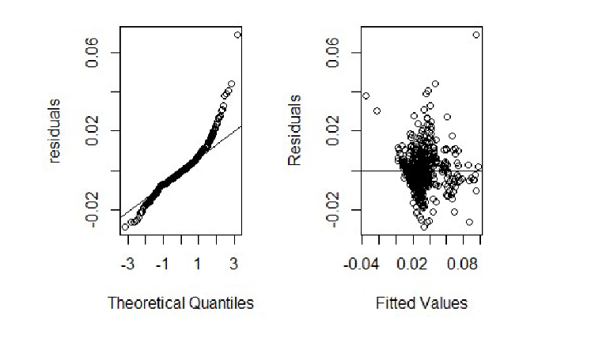

# PredictingCrimeRate



## Description
The model created in this repository was to explore the idea of predicting crime rate using a variety of statistical mythologies. The model was focused on the crime rate in North Carolina and used 3 datasets to compile information.

## Motivation
The motivation to do this project the way I did was to see how we could reduce variance and eliminate any multi-collinearity if found. Do this would allow me to build a model that reduced more bias and give more control into what variable we could use for prediction. This approach used linear and logistic regression to see how that fit our data in addition to other idea I could have explored as well.

## Methodology
### Cleaning
  - Check all variables
  - Check for null,missing and irregular values

### Data Exploration
  - Perform qq plot to look into variance and normality for residual and fitted value
  - Shapiro test for  additional variance testing
  - Null hypothesis testing
  - Linear regression fitting
  - Breusch–Pagan test to display possible heteroskedasticity(unequal variance)
  - Test if multi-collinearity show in the model
### Model Building
  - Perform forward step and back step to find most optimal variables
  - Perform box cox analysis
  - Test log transformation and vif analysis on model
  - Plot residual vs predictors 
  - Leverage and press graph
  - Calculate Cook Distance
  - Test model result after applying all modification

### Results:
  - Model got a r^2 around 0.75 with decreased variance and multi-collinearity

### Future analysis:
  - Ridge or lasso regression approach 
### Quick start
-  For looking at the model step by step you can look at the pdf file on your browser, GitHub support pdf viewing.

## Usage
The model explore using a variety of statistical operation with comments for exploration. Here some of the functions used for the data exploration:
...
## Contributing
1. Download R libraries:
   -  https://cran.rstudio.com/ 
2. Down R studio IDE:
   -  https://posit.co/download/rstudio-desktop/
3. Create folder and in terminal paste
   - ``` git clone https://github.com/Jruz9/PredictingCrime.git ```  
4. Open Rmd file and everything is ready.

 The project primarily written in R but can be adapted to anything that can accept a csv file for data exploration.